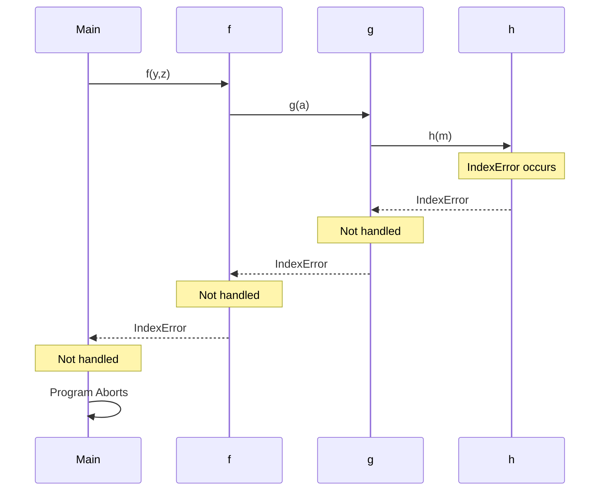

TARGET DECK: Programming-DSA::Python-Basics

FILE TAGS: #Programming-DSA #Python-Basics


Jupyter notebooks preferred - interactive, shareable,..etc

Julia + Python + R = Jupyter

---

[Colab](https://colab.research.google.com/drive/1Y1acs9uMrGUzgTuCjK1QHGruSnIa1Yxq?usp=sharing)

```python
def factors(n):
  factorlist = []
  for i in range (1,n+1):
    if n % i == 0:
      factorlist.append(i)
  return factorlist

factors(30)    # It prints because in colab the result of the last experession should print autometically as it is interactive.

def prime(n):
  return factors(n) == [1,n]

def prime(n):
  return len(factors(n)) == 2

primelist = []
for i in range(1,101):
  if prime(i):
    primelist.append(i)

print(primelist)


import numpy as np
import matplotlib.pyplot as plt
x = np.arange(0.0,5.0,0.01)
y = 1+  np.sin(2 * np.pi * x)
fig,ax = plt.subplots()
ax.plot(x,y)

```

What is GCD? #flashcard

- Gcd also called HCF (Highest Common Factor) or greatest common divisor.
- Largest positive integer dividing both numbers.
- Computed fastest using Euclidean Algorithm.
- gcd(a,b)=gcd(b,amodb).
- If gcd(a,b)=1, numbers are coprime.
- gcd(a,b)⋅lcm(a,b)=ab.
- Bézout: ∃x,y∈Z such that ax+by=gcd(a,b).
<!--ID: 1782233473010-->

---

Why does `sin(2πx)` look more like a sine wave than `sin(x)`? #flashcard

- $\sin(x)$ completes **1 full cycle** when its input changes by $2\pi \approx 6.28$.
- If $x\in[0,5]$, then $\sin(x)$ shows **less than one complete wave**.
- $\sin(2\pi x)$ makes the input go from $0$ to $10\pi$ when $x\in[0,5]$, giving **5 full cycles**.
- General form: $$y=\sin(2\pi f x)$$ where $f$ = frequency (cycles per unit x).
<!--ID: 1782233473013-->

```python
# Ineffecient algorithm in terms of space
def gcd(a,b):
  factorlist = []
  for i in range(1,min(a,b)+1):
    if (a % i) == 0 and (b % i) == 0:
      factorlist.append(i)
  return factorlist[-1]

gcd(22,40)

# efficient algorithm (space complexity)
def gcd(a,b):
  for i in range(1,min(a,b)+1):
    if a%i == 0 and b%i == 0:
      mrcf = i                    #Most recent common factor
  return mrcf

gcd(22,40)
```

- 1 is not a prime number.

Why do we check divisors only up to √n? #flashcard

- If n = a×b and both a,b > √n, then a×b > n (impossible).
- Therefore at least one factor must be ≤ √n.
- Prime test: check divisibility from 2 to int(√n)+1.
- Time complexity reduces from O(n) to O(√n).
<!--ID: 1782233473015-->

Why use `pd[d] = pd.get(d,0) + 1`? #flashcard

- Counts frequencies without checking if key exists. -`get(d,0)` returns current count or 0 if missing.
- Adds 1 and stores back into the dictionary.
- Replaces `if d in pd: ... else: ...` in one line.
<!--ID: 1782233473018-->

- All the factors till sqrt(n) are paird with factors before the sqrt(n)
- Twin primes : p,p+2 are twin primes. (3,5),(5,7),(11,13),(17,19),(29,31),(41,43),(59,61),(71,73)...

# Exception Handling

when the function get the case where the input is not valid, it should not crash the program, instead it should handle the exception and return a proper message to the user.

we can raise an exception using the `raise` keyword. The exception can be a built-in exception or a custom exception.

we can handle the exception using the `try` and `except` block. The code that may raise an exception is placed inside the `try` block, and the code that handles the exception is placed inside the `except` block. Observe : error is in Upper Camel Case(PascalCase)

```python
try:
    # code that may raise an exception
    x = int(input("Enter a number: "))
    print(10/x)
except ZeroDivisionError:
    print("You cannot divide by zero.")
except ValueError:
    print("Invalid input. Please enter a valid number.")
except Exception as e:
    print(f"An error occurred: {e}")
else:
    print("No exception occurred.")
finally:
    print("This block will always execute.")
```



Euclid algorithm for GCD
complexity O(log(min(a,b))) in other words, the number of digits in the smaller number.

```python
def gcd(a,b):
    while b:
        a,b = b,a%b
    return a
```

# OOPS - Classes and Objects

# special functions

**init** : constructor, called when object is created  
**del** : destructor, called when object is destroyed
**add** : handles +
**sub** : handles -
**mul** : handles \*
**ge** : handles >=
**le** : handles <=
**lt** : handles <
**gt** : handles >

# Timing our code

we have perf_tme

```python
import time
start = time.perf_counter()
....
....
end = time.perf_counter()
elapsed = end - start
```

Python executes 10^7 to 10^8 statements per second, so if your code takes more than a second, you should try to optimize it.

## Effeciency of ordering things

unsorted aadhar to sim connection takes 3200 years, sorted aadhar to sim connection takes 90 minutes. So, sorting is important.

---

## Practical tests:

Why Sieve of Eratosthenes is Fast #flashcard

- Goal: Find all primes up to $n$.
- Naive idea: For every number $k$, search for factors up to $\sqrt{k}$ → repeated work.
- Sieve idea: When a prime $p$ is found, immediately mark all multiples of $p$ as composite.
- Naive asks: "Is 20 prime?" again and again. Sieve already knows 20 was crossed out by 2.
- Naive = For each number, find factors. Sieve = For each factor, eliminate numbers.
- `sieve[i] = True` means "currently believed prime"; `False` means composite.
- Start with all numbers marked `True`, except 0 and 1.
- For each prime $p$, mark $p^2, p^2+p, p^2+2p,\dots$ as `False`.
- Start at $p^2$ because smaller multiples ($2p,3p,\dots,(p-1)p$) were already handled.
- Only process $p \le \sqrt{n}$ because every composite has a factor $\le \sqrt{n}$.
- After sieving, primality lookup is $O(1)$ using `sieve[i]`.
- Twin prime check becomes: `if sieve[i] and sieve[i+2]`.
- Time Complexity:
  - Naive primality for all numbers: roughly $O(n\sqrt n)$
  - Sieve: $O(n\log\log n)$
- Space Complexity: $O(n)$
- Mental Model: "Cross out enemies once; don't fight them repeatedly."
<!--ID: 1782310565644-->


GATE Trap #flashcard

- Many students write:
  `for i in range(2,n)`
- Better:
  `for i in range(2,int(n**0.5)+1)`
- Reason: If $n=ab$, at least one factor must satisfy $a \le \sqrt n$.
- Distinguish:
  - Single prime query → $\sqrt n$ primality test.
  - Many prime queries in a range → Sieve of Eratosthenes.
<!--ID: 1782310565649-->

